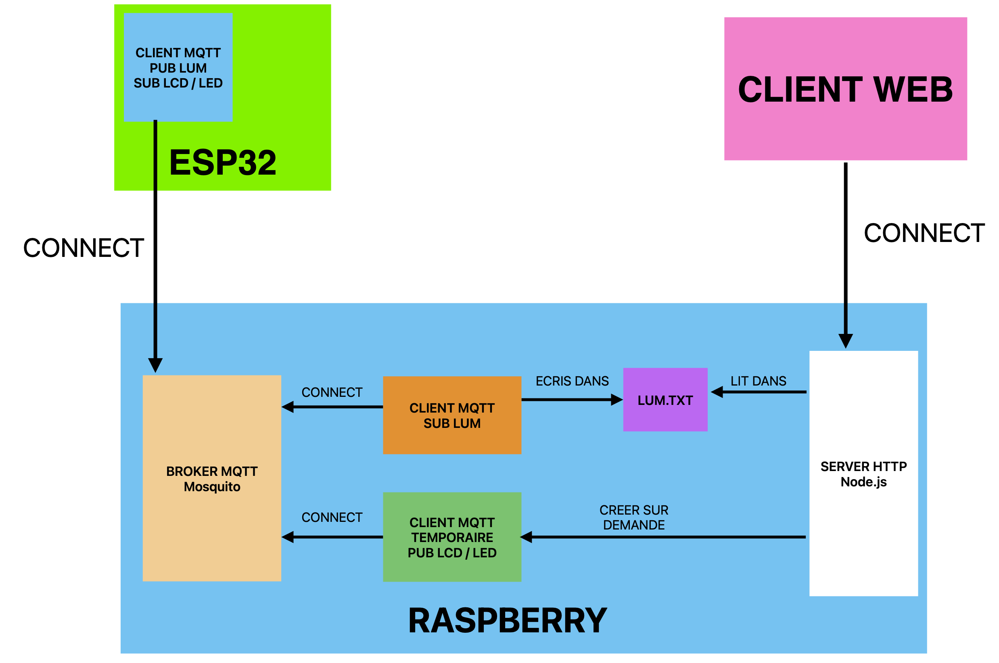
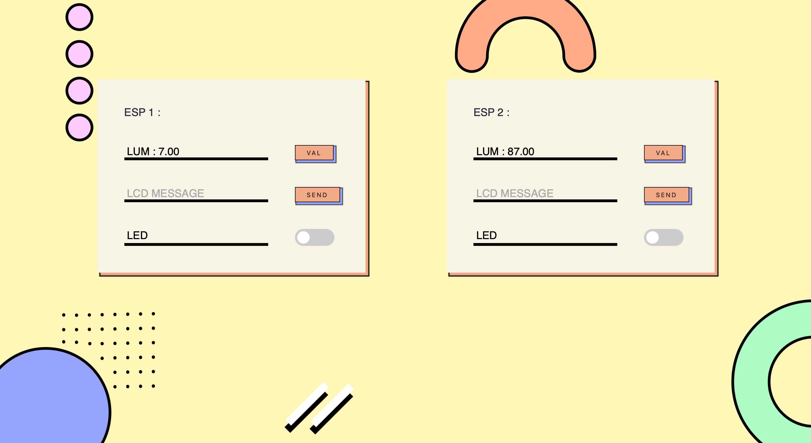
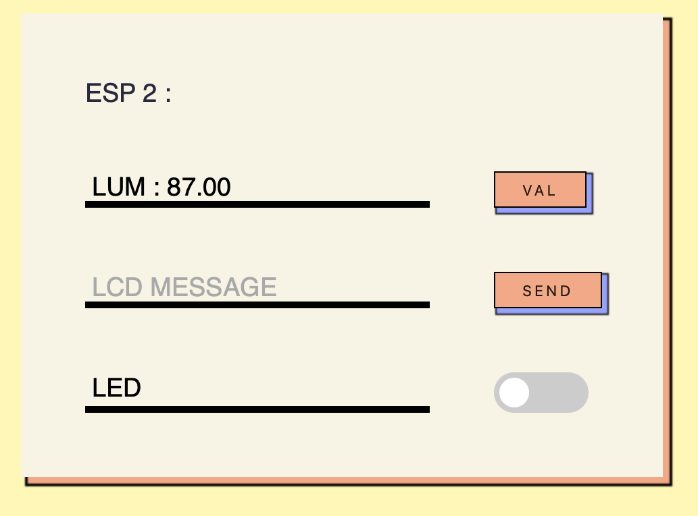
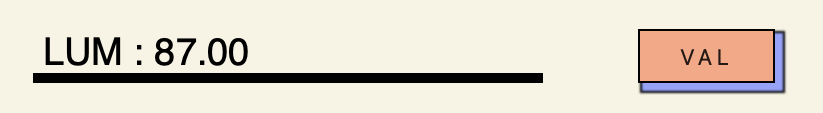
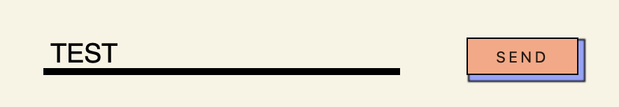
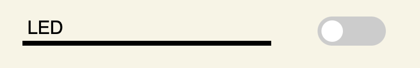
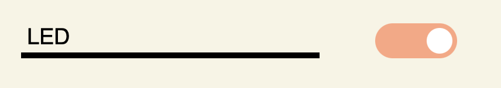

# IOC PROJET 2023
# LONGUET Axel & LAKHLEF Rayan

## Introduction 

Notre Projet consiste à envoyer des requêtes ou des commandes de notre page web codé en html sur notre l'esp32. Le protocole qu'on a utilisé est MQTT. Les commandes sont : 

- récupérer la valeur de la luminisoité ambiante de la pièce ou se trouve la carte et l'afficher sur le site web 
- A l'aide d'un switch sur le site Web controller la Led (OFF ou ON)
- Ecrire des messages sur le LCD et si le message envoyé est : 
    -- Mario => la musique de Mario sera joué par le Buzzer
## Résumé de l'architecture globale : 



## Pourquoi MQTT ?

MQTT est un protocole Publish/subscribe qui permet aux appareils de publier vers un broker. Les clients se connectent au broker, le broker sera le médiateur entre ces appareils. Chaque message transmis sur un topic par un client sera transféré à tous les autres clients qui y ont souscrit à ce topic.

L'illustration ci-dessous résume le principe de fonctionnement de MQTT : 


## ESP32 : 

Dans le cadre du projet nous allons utiliser la platforme materielle suivante : 


Elle est composé : 

* Un ESP32
* Un ecran OLED
* Un Buzzer
* Un bouton

Notre but est de pouvoir écrire des messages sur l'écran OLED, allumer / eteindre les LED et envoyer la valeur de luminosité vers le serveur.

### Mise en place du client MQTT

Dans un premier temps, nous devons être capable d'avoir un client MQTT sur notre ESP32 qui va s'abonné sur des topics et publish.


#### Definition des constantes 

On définit tous d'abord des constantes pour notre réseaux wifi pour que notre esp32 puisse se connecter dessus : 

```cpp
const char* ssid = "";
const char* password = "";
```

On définit ensuite les informations concernant notre broker MQT
```cpp
//Adresse IP du broker
const char* mqtt_server = "192.168.1.146";

//Topic MQTT a ecouter
const char* mqtt_topic = "esp2/led";
const char* mqtt_topic2 = "esp2/lcd";
```

Ici nous mettons le topic esp2/X car nous sommes sur le deuxieme ESP.
En effet, notre site est capable de controler 2 ESP32 les topics pour le premiers seront esp1/X et pour le deuxieme esp2/X

On utilise WiFiClient qui est une classe de la bibliothèque WiFi de Arduino pour que notre esp32 se connecte a notre Broker via TCP/IP

On utilise aussi PubSubClient afin de publier ou de s'abonner à des messages sur un broker MQTT
```cpp
WiFiClient espClient;
PubSubClient client(espClient);
```

#### Connexion WIFI

Dans la fonction setup_wifi, nous nous connectons au wifi : 

```cpp
void setup_wifi()
```

```cpp
WiFi.begin(ssid, password);
while (WiFi.status() != WL_CONNECTED) {
    delay(500);
    Serial.print(".");
}
```

Pour ce faire on utilise WIFI.begin pour se connecter à notre réseau WIFI.

#### Connexion BROKER

Dans la fonction reconnect, c'est au broker que nous nous connectons : 

```cpp
void reconnect() 
```

Cette fonction est bloquante tant que nous n'avons pas reussi à nous connecter à notre BROKER

```cpp
while (!client.connected()) 
```

Une fois notre connexion réussie, nous allons nous subscribe à nos topic définit précédement : 

```cpp
if (client.connect("ESP32Client2")) {
    client.subscribe(mqtt_topic);
    client.subscribe(mqtt_topic2);
  Serial.println("connected");
}
```

### Définitions de nos taches

#### Gestion du timer

On utilise ensuite la gestion des timers de la même façons que dans le TP5 avec la fonction waitFor

```cpp
#define MAX_WAIT_FOR_TIMER 9
unsigned int waitFor(int timer, unsigned long period)
```

#### Gestion de la communication

Pour que notre future tache LUM puisse communiquer sa valeur de luminosité avec notre tache MQTT, on utilise la meme structure de boite aux lettres que pour le TP5 : 

```cpp
enum {EMPTY, FULL};

struct mailbox_s {
  int state;
  int val;
};
```

#### Tache LUM

On utilise la meme tache LUM que dans le TP5 : 

```cpp
struct Lum_s {
  int timer;                                             
  unsigned long period;                                
  int pin;
}; 
```


```cpp
void loop_Lum( struct Lum_s * ctx,struct mailbox_s * mbLUM)
```

Dans notre loop, nous allons lire la valeur de notre photo-résistance.
Puis la mapper pour avoir un pourcentage de luminosité entre 0 et 100.

```cpp
unsigned int res = analogRead(ctx->pin);                
res = map(res,0,4096,100,0);
```

On met ensuite cette valeur dans la boite aux lettres pour que notre tache MQTT puisse s'en servir.

```cpp
mbLUM->val = res;
mbLUM->state = FULL; 
```

#### Tache MQTT

On définit maintenant une nouvelle tache MQTT qui va gérer le publish et la gestion de la réception de message en provenance du BROKER : 

```cpp
void loop_mqtt(struct mailbox_s * mbLUM)
```

Si notre boite au lettres provenant de LUM est vide, on quitte notre fonction car nous n'avons aucune valeur à envoyer.

```cpp
if (mbLUM->state == EMPTY) return;
```

Ensuite nous testons si nous sommes toujours connecté au BROKER car sinon nous ne pourrions pas envoyer nos données. 

```cpp
  if (!client.connected()) {
    reconnect();
  }
```

On récupere ensuite la valeur de notre LUM puis on la convertie pour pouvoir l'envoyer.
On utilise dtostrf qui permet de convertir un float en une chaîne de caractères.

```cpp
float lum = mbLUM->val;
char tempString[8];
dtostrf(lum, 5, 2, tempString); 
```

Nous faisons aussi de même pour notre topic : 

```cpp
char topic[50];
snprintf(topic, 50, "esp2/lum");
```

Ici esp2/lum sera esp1/lum pour le premier ESP.

Pour finir, on envoit nore valeur grâce à publish, en présisant le topic sur lequel on envoie cette valeur.
On indique aussi que notre boite au lettres est vide pour que la tache LUM puisse à nouveau écrire dedans.

```cpp
client.publish(topic, tempString); // Envoi de la donnée sur le topic 
mbLUM->state = EMPTY; 
```

#### Gestion de la réception de message

On définit maintenant une fonction callback qui sera appelée lorsque l'on récevera un message sur un des topic sur lequel nous nous sommes inscrit : 

```cpp
// Fonction de gestion de la réception des messages
void callback(char* topic, byte* payload, unsigned int length) 
```

On convertie tout d'abord notre payload en chaine de caractere : 

```cpp
String message = "";
    for (int i = 0; i < length; i++) {
    message += (char)payload[i];
}
```

Si notre message est sur le topic led.
On regarde la valeur de ce message, et on allume ou non notre LED : 

```cpp
if (message == "LED ON"){
    digitalWrite(LED_BUILTIN, HIGH);
}
if (message == "LED OFF"){
    digitalWrite(LED_BUILTIN, LOW);
}
```

Si notre message n'était pas sur le topic led mais lcd, 
on écrit alors notre message sur l'écran OLED : 

```cpp
for (int i = 4 ; i < length ; i++){
    display.write(message[i]);
}
display.display();
```

On ignore les 4 premieres caractere car notre message est de la forme LCD MESSAGE

### Setup de nos taches 

On effectue ensuite notre setup : 

On place la pin de notre LED en sortie : 

```cpp
pinMode(LED_BUILTIN, OUTPUT);
```

On setup notre LCD : 

```cpp
Wire.begin(4, 15);
if(!display.begin(SSD1306_SWITCHCAPVCC, 0x3C)) { // Address 0x3C for 128x32
    Serial.println(F("SSD1306 allocation failed"));
    for(;;); // Don't proceed, loop forever
}
display.display();
```

On configure notre communication SERIAL : 

```cpp
Serial.begin(115200);
```

On se connecte au WIFI : 

```cpp
setup_wifi();
```

On setup ensuite notre BROKER ainsi que notre fonction de callback : 

```cpp
client.setServer(mqtt_server, 1883);
client.setCallback(callback);
```

Enfin, on setup notre tache LUM 

```cpp
setup_Lum(&Lum1,5,5000000,A0);
```

### Loop de nos taches

Dans notre loop, on execute la loop MQTT et LUM : 

```cpp
void loop() {
  loop_mqtt(&mbLUM);
  loop_Lum(&Lum1,&mbLUM);       
}
```

## Broker MQTT : 

Pour notre broker MQTT, nous utilisons Mosquitto 

https://mosquitto.org

### Fichier de Config :
Pour que notre broker fonctionne, il faut définir un fichier de config dans le fichier : /etc/mosquitto/mosquitto.conf 

```txt 
# Place your local configuration in /etc/mosquitto/conf.d/
#
# A full description of the configuration file is at
# /usr/share/doc/mosquitto/examples/mosquitto.conf.example

# Connexion possible pour tout le monde
allow_anonymous true

# Fichier mot de passe
password_file /etc/mosquitto/pwfile

# Port du BROKER 
listener 1883
```

### Démarrer notre BROKER : 

Pour démarrer notre BROKER, on lance la commande suivante : 

```shell
mosquitto -c /etc/mosquitto/mosquitto.conf 
```

On donne en argument de cette commande le fichier de config dénfinit précédement.
Maintenant nous avons notre BROKER qui tourne en permanance.


## Client MQTT sur notre RASBPERRY: 

Pour recevoir les informations que nos client MQTT sur nos ESP32 vont envoyer au BROKER.
Notre rasbperry doit aussi avoir son client MQTT. Ce dernier va devoir se connecter au BROKER, s'abonné sur les topics lum et faire de la gestion de ces donnée.

### Reception de requete : 

Pour dénifir notre client MQTT nous utilisons python : 

#### Biblioteque utilisé : 

On utilise paho.mqtt.client qui est une bibliothèque python qui fournit un client MQTT. 
```py 
import paho.mqtt.client as mqtt
```

#### Définition des constantes MQTT : 

Nous devons définir : 

* L'adresse IP de notre BROKER
* Son numéro de port
* les topic auquels il va se subsribe

Ce qui donne : 
```python
broker_address = "172.20.10.5"
broker_port = 1883
mqtt_topic = "esp1/lum"
mqtt_topic2 = "esp2/lum"
```

#### Fonction de connection : 

Lors de notre connection, on doit se subscribe à nos topic LUM : 

```python
# Fonction de gestion de la connexion
def on_connect(client, userdata, flags, rc):
    print("Connection au broker MQTT avec le code retour : " + str(rc))
    
    client.subscribe(mqtt_topic)
    client.subscribe(mqtt_topic2)
```

De ce fait, notre client pourra recevoir les différentes valeur de luminosité mesurée.

#### Fonction de réception de message : 

Lorsque l'on aurra un message sur l'un des topic que nous avons subscribe, c'est cette fonction qui sera appellée.

```python
# Fonction de gestion de la reception des messages
def on_message(client, userdata, msg):
    print("Message recu sur le topic "+msg.topic+" : "+str(msg.payload.decode()))
```

En fonction du topic sur lequel le message à été envoyé, nous écrirons soit la valeur de luminosité dans un fichier lum1.txt 

```python
if msg.topic == "esp1/lum":
    f = open("../CAPTEUR/lum1.txt", "w")
    f.write(str(msg.payload.decode())+"\n")
    f.close()
```

Soit dans un fichier lum2.txt

```python
if msg.topic == "esp2/lum":
    f = open("../CAPTEUR/lum2.txt","w")
    f.write(str(msg.payload.decode())+"\n")
    f.close()
```

#### Initialisation de notre client MQTT : 

On initialise notre client MQTT : 
```python
# Initialiser le client MQTT
client = mqtt.Client()
```

La biblioteque paho.mqtt.client définit ces 2 fonctions : 

* on_connect qui est appelée par le client MQTT lorsque la connexion avec le broker MQTT est réussit
* on_message qui est appelée par le client MQTT lorsqu'un message est reçu sur un topic auquel le client est abonné

On les connecte donc ces 2 fonctions avec notre nos fonctions définit précédement : 

```python 
# Definir les fonctions de rappel
client.on_connect = on_connect
client.on_message = on_message
```

Finalement, on connecte notre client au BROKER : 

```python
# Se connecter au broker MQTT
client.connect(broker_address, broker_port)
```

On peut donc lancer notre client avec la commande. : 

```shell 
python3 ./clientMQTT.py
```

Notre programme s'executera en boucle et recevera les valeurs de LUM de nos ESP32 avant de les écrires dans un fichier.

## La gestion du publish sur le RASBPERRY

Pour le publish de message sur les topic lcd ou led, nous avons décidé de créer un client MQTT temporaire.
En effet, contrairement à notre Client MQTT pour la gestion de lum, ce client ne tournera pas en permanance.

Ce dernier va se connecter au BROKER pour envoyer un seul message puis se déconnecter.
Nous avons fait ce choix au vu de comment nous avons géré l'envoie de requette au travers de notre serveur HTPP. Nous rentrerons dans les détails du serveur HTTP apres.


### Script python 

Pour l'envoi de requête, on utilise un autre programme python sendMQTT.py.
En effet, notre serveur HTTP lancera la commande suivante lorsqu'il voudra communiquer avec l'ESP32 : 

```shell 
python3 sendMQTT.py TOPIC MESSAGE
```

Cela aura pour effet de créer un client MQTT qui va se connecter à notre BROKER pour envoyer un message MESSAGE sur le topic TOPIC.
Une fois fait, le client se déconnecte du broker.

#### Biblioteque utilisé : 

Comme pour la réception, on utilise paho.mqtt mais cette fois la biblioteque publish

```python
import paho.mqtt.publish as publish
import sys
```

Nous utilisons aussi sys pour récupérer les arguments donnés lors du lancement de la commande.

#### Définition des constantes MQTT : 

```python
# Definir les informations du broker MQTT
mqtt_broker = "172.20.10.5"
mqtt_port = 1883
mqtt_topic = sys.argv[1]
```

On définit ici l'adresse IP de notre BROKER ainsi que son numéro de port.
On récupere également notre topic.

#### Publish un message 

```python
# Publier un message sur le topic specifie
message = sys.argv[2]
publish.single(mqtt_topic, payload=message, hostname=mqtt_broker, port=mqtt_port)
```

Pour publish notre message on utilise la fonction paho.mqtt.publish


## Serveur HTTP

Pour notre serveur, nous allons utiliser Node.js.
Node.js permet d'exécuter du code JavaScript côté serveur.

https://nodejs.org/en

Nous avons utilisé cela au lieu de python, car nous avions déjà fait un serveur de ce type dans un précédent projet.

Pour pouvoir router nos requêtes HTTP, nous utiliserons express. Express.js est un framework de Node.js qui permet de développer applications web. Il offre des fonctionnalités telles que la gestion des routes. C'est ce que nous utiliserons en priorité dans notre projet pour router nos requêtes HTTP en provenance des clients WEB.

https://expressjs.com

### Création du serveur : 

On lance la commande : 
```shell
npm init -y
```

Pour notre server Node.js, on utilise la biblioteque express qui fournit une interface simple pour la gestion des requêtes HTTP. Requete qui seront celle utilisées pour notre serveur.
Nous utiliserons aussi body-parser pour récupérer les arguments dans le corps de nos requete HTTP.

```shell 
npm install express
npm install body-parser
```

### Programmation du serveur : 

On crée un fichier server.js qui s'occupera de recevoir les requêtes et renvoyer la page à afficher pour le client : 

#### Import des biblioteques : 

Nous avons la biblioteque FS pour lire et ecrire dans des fichiers 

```javascript
const {readFileSync, writeFileSync} = require('fs');
```

Express pour router nos requetes HTTP

```javascript
const express = require('express');
const app = express();
```

BodyParser pour récupérer les données envoyer dans les requetes HTTP du client.

```javascript
const bodyParser = require('body-parser');
app.use(bodyParser.urlencoded({ extended: true }));
```

#### Principe de Express.js

Le principe de express est de "router" les requetes recut depuis le client HTTP

Ce routage prend la forme suivante : 

```javascript
app.type(path,(req,res) => {

})
```

1. Type notre type de requete HTTP, par exemple : 

* GET
* POST 
* PUT
* DELETE

2. Path, l'URI de la requête HTTP
3. req le corps de la requête HTTP
4. res la réponse de la requête qui sera renvoyée au client
5. => {} La fonction appelée lors de la requête


La page HTML que nous renverons à notre client se fera de la manière suivante : 


```javascript
res.send(`
    <!DOCTYPE html>
    <html lang=fr>
        <head>
        </head>
        <body>
        </body>
    </html>
`);
```

Donc pour résumer, voici un exemple de traitement d'une requete GET sur l'URI /BONJOUR 

```javascript
app.get("/BONJOUR",(req,res) => {
    res.send(`
        <!DOCTYPE html>
        <html lang=fr>
            <head>
            </head>
            <body>
                BONJOUR
            </body>
        </html>
    `);
})
```
#### Affichage coté client : 

Voici la route Express qui géré l'affichage de la page web initiale lorsque le client se rend pour la premiere fois sur le site : 


```javascript
app.get('/',(req,res) => {

}
```

Notre page principale est de la forme suivante : 



On peut voir que nous avons 2 menus qui gere chacun un ESP.




Chaque menu contient : 

* la valeur du capteur de luminosité qui peut etre rafrachit lors de l'appui sur un bouton.
* L'écriture d'un message qui sera envoyer vers l'ecran OLED 
* En effin une switch pour allumer / etiendre la led de l'ESP

#### Récuperation de la valeur de luminosité : 

* ##### Coté client : 

Lorsque l'utilisateur voudra avoir la valeur du capteur, il appuira sur la bouton val 



Cela aura pour effet d'envoyer une requete HTTP GET vers l'URI /LUM

```javascript
<form method="GET" action="/LUM">
    <span class="val">LUM : ${lum}</span>
    <button name="send" type="submit" value="../CAPTEUR/lum1.txt">VAL</button>
</form>
```

On peut voir que notre valeur lum est ecrite de la maniere suivante : ${lum} car c'est une variable javascript de notre serveur.
Lorsque l'on enverra la réponse, la valeur sera remplacé par celle de la variable.

* ##### Coté serveur : 

On récupère notre requête grâce à la route Express suivante : 

```javascript
app.get('/LUM',(req,res) => 
```

Dans la fonction, nous allons tous d'abord lire la valeur de luminosité écrite dans le fichier par notre client MQTT. 

```javascript
var val = readFileSync(req.query.send,'utf-8');
```

Pour savoir quel fichier lire, ce dernier sera spécifié dans la requete HTTP (lum1.txt si EPS1 sinon lum2.txt)

Ensuite nous mettons à jour notre variable lum ou lum2 : 

```javascript
if (req.query.send == "../lum1.txt") lum = val
else lum2 = val
```

On renvoie ensuite notre page html avec la valeur de lum modifié (Version réduite pour l'exemple ici) : 

```javascript 
res.send(`
    ... 
    <form method="GET" action="/LUM">
        <span class="val">LUM : ${lum}</span>
        <button name="send" type="submit" value="../CAPTEUR/lum1.txt">VAL</button>
    </form>
    ...
`)
```

#### Envoie d'un message sur l'écran OLED : 

* ##### Coté client : 

Pour envoyer un message à afficher sur l'écran OLED de l'ESP, on remplit un formulaire avec notre message puis on appuie sur send



Cela aura pour effet d’envoyer une requete HTTP POST vers l’URI /LCD

```javascript
<form methode="POST" action="/LCD">
    <input id="lcdSEND" name="lcd" type="text" placeholder="LCD MESSAGE">
    <button name="send" type="submit" value="esp1/lcd">SEND</button>
</form>
```

On spécifie dans la valeur du bouton le topic vers lequel le message sera envoyer esp1/lcd dans le cas du premier ESP esp2/lcd sinon.

* ##### Coté serveur :

On récupère notre requête grâce à la route Express suivante : 

```javascript
app.post('/LCD',(req,res) => {
```

Pour pouvoir lancer notre script python sendMQTT.py nous avons besoin de la bibliothèque child_process : 

```javascript 
const { spawn } = require('child_process');
```

On définit ensuite le chemin de notre programme : 

```javascript
const scriptPath = 'sendMQTT.py';
```

On lance ensuite notre script python avec la fonction spwan.

```javascript
const pythonProcess = spawn('python3', [scriptPath,req.query.send,'LCD '+ req.query.lcd]);	
```

Avec  : 

* req.query.send : TOPIC du message
* req.query.lcd  : MESSAGE 

On récupère ces valeurs dans le corps de la requete HTTP ce qui correspond à req.query.

* send correspond à notre boutton dont le nom était send et qui contient le nom du topic
* lcd correspond à notre input dont le nom était lcd et qui contient le message 

On renvoie ensuite notre page html avec le formulaire vide (Version réduite pour l'exemple ici) : 

```javascript 
res.send(`
    ...
    <form methode="POST" action="/LCD">
        <input id="lcdSEND" name="lcd" type="text" placeholder="LCD MESSAGE">
        <button name="send" type="submit" value="esp1/lcd">SEND</button>
    </form>
    ...
`)
```


#### Commande de la LED : 

* ##### Coté client : 

Pour allumer / eteindre la led on dispose d'une switch.


Lorsque l'on décoche la switch pour eteindre la led : 




```javascript
<input type="checkbox" name="checkbox" value="dark" onclick="clickFn1(event)">
```

Lorsque l'on coche la switch pour allumer la led :



```javascript
<input type="checkbox" checked name="checkbox" value="dark" onclick="clickFn1(event)">
```

Quelque soit l'état de la switch on envoie une requete HTTP POST avec l'URI LED

```javascript
<form method="post" action="/LED">
    <input type="hidden" id="led2" name="led" value="test">
    <input type="hidden" name="send" value="esp2/led">
</form>
```

Comme on peut le voir, le nom du topic est précisé dans l'input send et l'état de la LED dans l'input led.

Mais en HTML, il est impossible d'envoyer l'etat d'une checkbox décoché dans une requete HTTP.
C'est donc pour cela qu'on utlise un formulaire caché qui sera envoyé.

Dans le code de la checkbox, on ajoute le parametre suivant : 

```javascript
onclick="clickFn1(event)"
```

Cela aura pour effet d'exécuté la fonction javascript clickFn1 lorsque l'on cliquera sur la checkbox.

```javascript
function clickFn1(event) {
    const checkbox = event.currentTarget;
    const led = document.getElementById("led1");
    led.value = checkbox.checked ? 'LED ON' : 'LED OFF';
    led.closest('form').submit()          				
}
```

Dans cette fonction, on récupère le form caché vu précédement avec la fonction document.getElementById.
Ensuite, en fonction de la valeur de la checkbox, on change le message envoyé dans l'input led. 

Ensuite, grâce à la méthode submit(), on envoie la requete HTTP de notre form caché.

* ##### Coté serveur :  

On récupère notre requête grâce à la route Express suivante : 

```javascript
app.post('/LED',(req,res) => {
```

Comme pour LCD, on lance le script python sendMQTT.py 

```javascript
const { spawn } = require('child_process');
const scriptPath = 'sendMQTT.py';

const pythonProcess = spawn('python3', [scriptPath,req.body.send,req.body.led]);
```

* req.body.send : le TOPIC
* req.body.led  : LED ON ou LED OFF 

Ensuite en fonction du message envoyé, on mettre notre checkbox comme checké ou non : 

```javascript 
if (req.body.led == "LED ON") led1_status = `<input type="checkbox" name="checkbox" checked value="dark" onclick="clickFn1(event)">`
else led1_status = `<input type="checkbox" name="checkbox" value="dark" onclick="clickFn1(event)">`
```

Et de meme si jamais la requete est pour l'ESP 2

On renvoie ensuite au client la page HTML avec la checkbox chéker ou non. (Version réduite pour l'exemple ici)

```javascript
res.send(` 
    ...
    <form>
        <span class="val">LED </span>
        <label class="switch">
        ${led1_status}
        <span class="slider round"></span>
    </form>
    ...
`)
```


#### Mise en forme : 

On ajoute aussi une route Express pour le fichier de mise en form CSS

```javascript
app.get('/style.css',(req,res) => {
	res.sendFile(__dirname + "/" + "style.css");
}); 
```

#### Démarage du serveur : 

On choisit le port 8000 pour notre serveur ainsi que sont adresse IP

```javascript
app.listen(8000,() => console.log('http://192.168.1.146/'));
```

On lance maintenant notre serveur avec la commande : 

```shell
node server.js
```